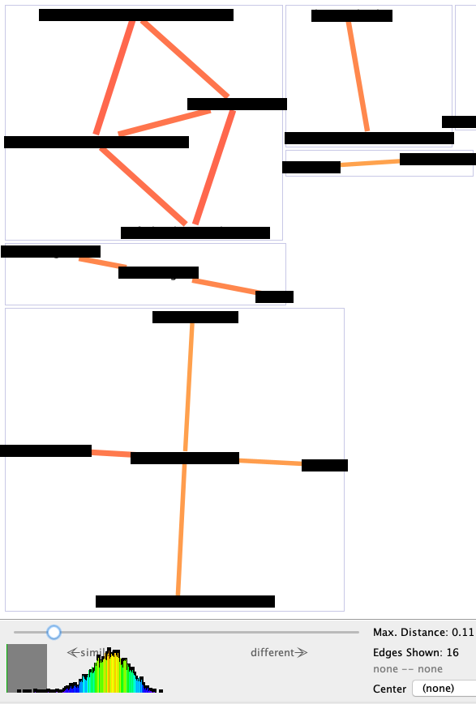

## Linguagem de Programação (ECT-2303)

### Introdução e Motivação 

---

### Horários de Atendimento

- Prof. Turma teórica: Carlos Olarte <carlos.olarte@gmail.com>
- Prof. Laboratório: Bruno Silva <brunomfs@gmail.com>

- Horários de atendimento (Discord):
 - segunda: 14-15
 - quarta:  14-15
- Monitoria (Discord, #monitoria)
---

### Porque aprender uma linguagem de programação?

Todos temos que _resolver problemas_. 

Pensar *algoritmicamente* lhe permitirá **solucionar problemas mais rápido**. 
<!-- .element: class="fragment" -->
Muitos dispositivos/sistemas podem ser __programados__ 
<!-- .element: class="fragment" -->


Um engenheiro que sabe *usar corretamente* o computador pode realizar tarefas  mais rápido.
<!-- .element: class="fragment" -->

---

### Será que programar é mesmo importante?

Em 2015, o ensino de computação nos Estados Unidos a partir dos 6 anos tornou-se obrigatório.

<iframe width="383" height="191" src="https://www.youtube.com/embed/6XvmhE1J9PY" frameborder="0" allow="accelerometer; autoplay; encrypted-media; gyroscope; picture-in-picture" allowfullscreen></iframe>

---

### Será que programar é mesmo importante?
[Oportunidades de emprego](https://www.wired.com/2017/02/programming-is-the-new-blue-collar-job/)

Assista: [Por que todos deveriam aprender a programar?](https://www.youtube.com/watch?v=mHW1Hsqlp6A)

>> Everyone should learn how to program a computer because it teaches you how to _think_ (Steve Jobs).

---

### Alguns algoritmos mudaram nosso mundo!

 * _Quick sort_: ordenar um conjuntos de dados.
 * _Binary search_: buscar elementos em um conjunto de dados.
 * _Generar números aleatórios_: simulações, jogos, testes, etc.
 * _Compressão de dados_: fundamental para streaming.
 * _Criptografia_: para manter nossos dados seguros.
 * _Reconhecimento de padrões_: classificar objetos.
 * _Back propagation_: redes neurais 

--- 

### Também as linguagens de programação mudaram nosso mundo!

 * _COBOL_ (um pouco velha), pioneira no processamento de dados.
 * _C_, sem ela, não teríamos Linux, Unix, Windows, Java, etc.
 * _HTML_, mudou completamente a forma como compartimos,  buscamos e visualizamos informações.
 * _SQL_, permitiu realizar consultas em bancos de dados de maneira eficiente.
 * _Python_, facilitou o uso de ferramentas de machine learning e data science.
 * _ML_, facilitou a implementação de provadores de teoremas.


---

### Relação da Disciplina com o BCT

Algumas das competências e habilidades previstas no BCT:

 * capacidade de identificar, avaliar e _resolver problemas_, enfrentar desafios e responder a novas demandas da **sociedade contemporânea**.
 * capacidade de atuar em *áreas de fronteira* e interfaces de _diferentes disciplinas_ e campos de saber.
 * atitude investigativa, de prospecção, de _permanente busca_ e produção do conhecimento.

 ---

 ### Nossa abordagem

  * _Entender_ o problema a resolver.
  *  Pensar em uma _sequência  de instruções_
  *  Agora sim,  _escrever o código_

--- 

### Os problemas que poderemos resolver

 * Tomar decisões (simples e complexas)
 * Solucionar funções/problemas matemáticos
 * Simular sistemas simples
 * Armazenar informação em estruturas de dados
 * Manipular vetores e matrizes
 * Ordenar conjuntos de dados. 
 * Buscar informações em um conjunto de dados. 

---

 ### Atenção!

Não tente escrever um  programa se _não sabe_ como resolver o problema!

A linguagem é só uma ferramenta... por si só não solucionada nada!

--- 

### Exemplo 
>> Exemplo: Como calcular $\sum\limits_{i=1}^{n} i $ ?

--- 

### Exemplo

>> Exemplo: Como calcular $\sum\limits_{i=1}^{n} i $ ?

```cpp
soma = 0 ;
for(int i=1;i<=n;i++)
 soma += i;
``` 
```cpp
 // Muito mais simples!
 soma = n * (n+1) / 2 ;
```

--- 

### Objetivos 

Desenvolver a capacidade de _projetar algoritmos_ e **implementá-los** em uma linguagem de programação estruturada

Tornar o aluno apto a _solucionar problemas_ utilizando linguagens de programação estruturadas.
<!-- .element: class="fragment" -->

Os conceitos serão implementados na linguagem C++. 
<!-- .element: class="fragment" -->

Vamos introduzir conceitos de _programação modular_ através do uso de _funções e estruturas_.
<!-- .element: class="fragment" -->

--- 

### Cronograma

 - Tipos, operadores, expressões. 
 - Revisão de estruturas de controle
 - Funções (parâmetros por valor referência)
 - Vetores e Matrizes
 - Algoritmos de ordenação e busca
 - Tipos Estruturados
---

### Aulas Teóricas

 - Têm como objetivo  apresentar novos conteúdos e demonstrar seu funcionamento.
 - Também serão utilizadas para revisões e esclarecimento de dúvidas.
 - Salvo situações excepcionais, começam no horário marcado com tolerância de 5 minutos.

---

### Aulas Teóricas (Metodologia) 

 - Utilizaremos sempre o mesmo link do Google Meeting
 - Antes da aula (no Discord #aulas)
  - Vídeo (prof. Éverton) explicando o conteúdo
  - Seções sugeridas da apostila 
  - Outras leituras 
 - Durante a aula (Google Meeting)
  1. Reproduzir o vídeo
  2. Tirar dúvidas
  3. Exercícios adicionais
  4. Test relâmpago (Multiprova)

--- 

### Práticas de Laboratório

 - As aulas de laboratório não têm como objetivo repetir o conteúdo das aulas teóricas.
 - Elas consistem, em sua maioria, na resolução de exercícios e esclarecimento de dúvidas.

--- 

### Práticas de Laboratório (Metodologia)
 - Lista de exercícios no sistema LOP

---

### Avaliação

                       
 - 40% Teórica
 - 60% Laboratório

 - Todas as aulas e todos os laboratório têm nota!
 - O aluno que faltar as aulas/labs, ficará com zero na nota desse dia 

--- 

### Avaliação
 - Fraude em um exercício implica zero na nota da unidade!
 <center>

</center>


---

### Bibliografia 

 - C++: Como Programar, de Paul Deiltel e Harvey Deitel. Editora Pearson.
 - MIZRAHI, V. V. Treinamento em Linguagem C++. Pearson, 2008
 - HERBERT, S. C completo e total. 3a. ed. São Paulo: Pearson, 1997. 
 - ASCENCIO, A, F. G.; DE CAMPOS, E. A. V. Fundamentos da programação de computadores.  Pearson Education, 2008

---

### Resultados Esperados
Após finalizar o semestre, eu espero que melhorem suas habilidades para:
  - _Quebrar um problema grande_ em partes menores.
  - *Abstrair*: identificar a parte essencial de um problema.
  - *Reaproveitar soluções*: utilizar a mesma função várias vezes para solucionar, possivelmente, problemas distintos.
  - *Solucionar problemas* utilizando uma linguagem de programação.

---
## Sejam Bem-vindos!

