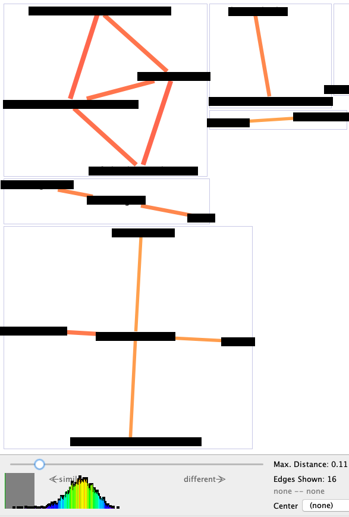

## Linguagem de Programação (ECT-2303, T03C e T03D)

---

### Horários de Atendimento

- Prof. Turma teórica: Francisco Vidal
- Prof. Laboratório: Carlos Olarte <carlos.olarte@gmail.com>

- Horários de atendimento: 7 x 24 ;-)
- Mensagens pelo Discord ou email
- Monitoria (Discord, #monitoria)
---

### Porque aprender uma linguagem de programação?

Todos temos que _resolver problemas_. 

Pensar *algoritmicamente* lhe permitirá **solucionar problemas mais rápido**. 
<!-- .element: class="fragment" -->
Muitos dispositivos/sistemas podem ser __programados__ 
<!-- .element: class="fragment" -->

Um engenheiro que sabe *usar corretamente* o computador pode realizar tarefas  mais rápido.
<!-- .element: class="fragment" -->

---

### Será que programar é mesmo importante?
[Oportunidades de emprego](https://www.wired.com/2017/02/programming-is-the-new-blue-collar-job/)

Assista: [Por que todos deveriam aprender a programar?](https://www.youtube.com/watch?v=mHW1Hsqlp6A)

>> Everyone should learn how to program a computer because it teaches you how to _think_ (Steve Jobs).

---

### Alguns algoritmos mudaram nosso mundo!

 * _Quick sort_: ordenar um conjuntos de dados.
 * _Binary search_: buscar elementos em um conjunto de dados.
 * _Generar números aleatórios_: simulações, jogos, testes, etc.
 * _Compressão de dados_: fundamental para streaming.
 * _Criptografia_: para manter nossos dados seguros.
 * _Reconhecimento de padrões_: classificar objetos.
 * _Back propagation_: redes neurais 

--- 

### Também as linguagens de programação mudaram nosso mundo!

 * _COBOL_ (um pouco velha), pioneira no processamento de dados.
 * _C_, sem ela, não teríamos Linux, Unix, Windows, Java, etc.
 * _HTML_, mudou completamente a forma como compartimos,  buscamos e visualizamos informações.
 * _SQL_, permitiu realizar consultas em bancos de dados de maneira eficiente.
 * _Python_, facilitou o uso de ferramentas de machine learning e data science.
 * _ML_, facilitou a implementação de provadores de teoremas.

---

 ### Nossa abordagem

  * _Entender_ o problema a resolver.
  *  Pensar em uma _sequência  de instruções_
  *  Agora sim,  _escrever o código_

---

 ### Atenção!

Não tente escrever um  programa se _não sabe_ como resolver o problema!

A linguagem é só uma ferramenta... por si só não solucionada nada!

--- 

### Exemplo 
>> Exemplo: Como calcular $\sum\limits_{i=1}^{n} i $ ?

--- 

### Exemplo

>> Exemplo: Como calcular $\sum\limits_{i=1}^{n} i $ ?

```cpp
soma = 0 ;
for(int i=1;i<=n;i++)
 soma += i;
``` 
```cpp
 // Muito mais simples!
 soma = n * (n+1) / 2 ;
```

--- 

### Objetivos (do laboratório)

Desenvolver a capacidade de _projetar algoritmos_ e **implementá-los** em uma linguagem de programação estruturada

Resolver problemas utilizando uma linguagem de programação

Ser hábil em propor soluções algorítmicas para problemas. 

--- 

### Práticas de Laboratório

 - As aulas de laboratório não têm como objetivo repetir o conteúdo das aulas teóricas.
 - Elas consistem, em sua maioria, na resolução de exercícios e esclarecimento de dúvidas.
 - Lista de exercícios no sistema LOP

--- 

### Avaliação

 - Todos os laboratório têm nota!
 - O aluno que faltar aos laboratórios, ficará com zero na nota desse dia 

--- 

### Avaliação
 - Fraude em um exercício implica zero no laboratório. 
 - Se reincidir, zero na unidade. 
 <center>

</center>

---

### Resultados Esperados
Após finalizar o semestre, eu espero que melhorem suas habilidades para:
  - _Quebrar um problema grande_ em partes menores.
  - *Abstrair*: identificar a parte essencial de um problema.
  - *Reaproveitar soluções*: utilizar a mesma função várias vezes para solucionar, possivelmente, problemas distintos.
  - *Solucionar problemas* utilizando uma linguagem de programação.

---
### Metodologia

Em cada laboratório:
 - Lista de exercícios (disponível por 24h)
 - Estarei disponível no Discord para tirar dúvidas
 - Os monitores Lucas de Oliveira e Lucas Augusto estão também disponíveis para tirar dúvidas
 - Faça os exercícios durante a hora do laboratório (7M34, 7M56)

---
### Metodologia
- Presença exige fazer __pelo menos uma questão__.
- A nota do laboratório será calculada segundo o número de exercícios resolvidos. 
- O código será revisado também pelo professor:
  - Utilização correta de funções
  - Sem variáveis globais
  - Parâmetros por referência (quando for necessário)
  - etc. 

---
### Ferramentas

Instale no seu computador/dispositivo um IDE e compilador de C++

- [Code::Blocks](http://www.codeblocks.org/)
- [Visual Studio](https://code.visualstudio.com/docs/cpp/config-mingw)

Ferramentas online:

- [C++ Shell](http://cpp.sh/)
- [Repl](https://repl.it/)
- [Ideone](https://ideone.com/)

---
### Ferramentas

Sistema LOP

<https://lop.natalnet.br/>

Faça o cadastro e se inscreva na sua turma:
 - T03C: f0a391cc54
 - T03D: 40fa02c83d

Demo.

1. Primeiro resolva o problema no seu compilador/ferramenta
2. Teste seu código e verifique que as saídas correspondem
3. _Depois_ disso, teste seu programa no sistema LOP

---
### Ferramentas

Sistema LOP

Erros comuns: 
```
Saída LOP: o número 3 é primo
Sua saída: O número 3 é primo
```

ou
```
Saída LOP: [ 1 , 2 , 3 ]
Sua saída: [ 1, 2, 3 ]
```

Copie/cole a saída do sistema num editor e compare.

---
## Sejam Bem-vindos!

