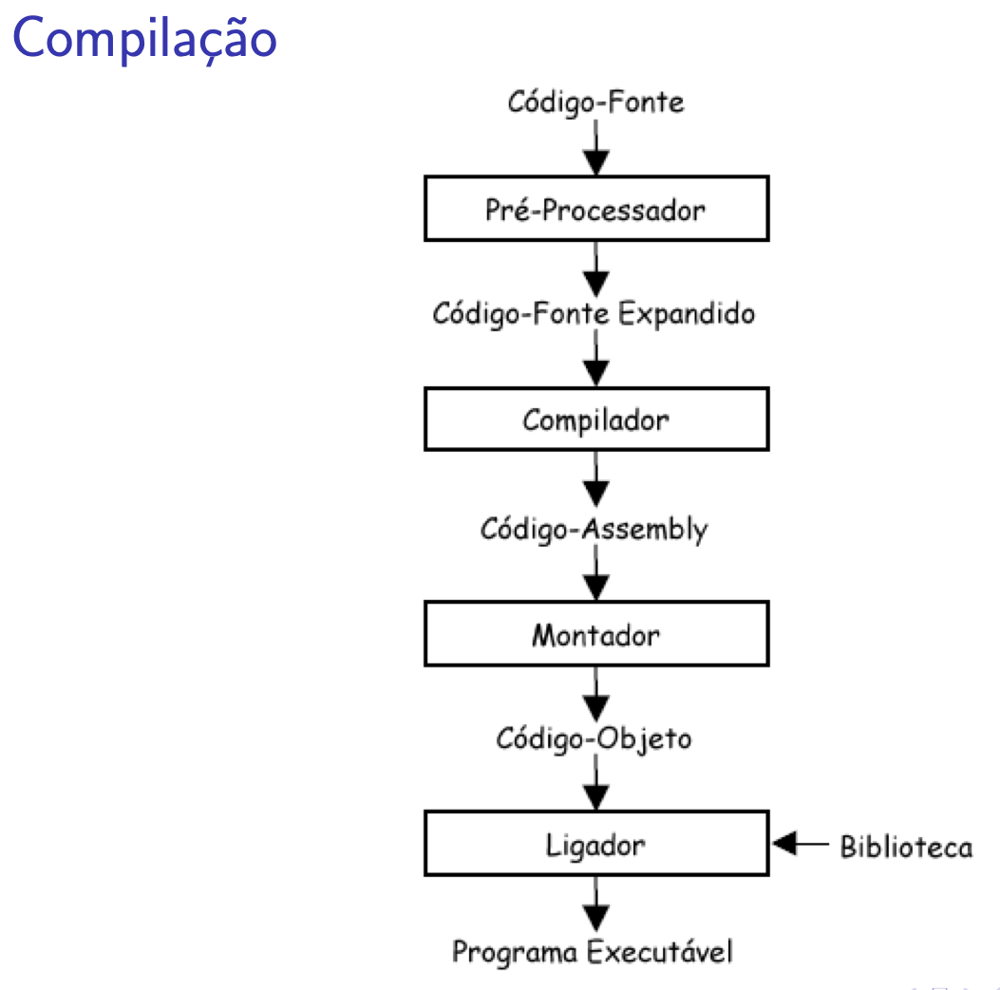

## Linguagens de Programação

--- 

### Objetivos

 - Introduzir o conceito de linguagens de programação.
 - Apresentar a linguagem C++
 - Explicar como funciona o processo de compilação e interpretação

 #### Vídeo da aula (até 10:17)
 ---

 <iframe width="1206" height="678" src="https://www.youtube.com/embed/HFO-9gBz5uo?list=PLLjLO9s7KS4UBrOBelz0GyfiFn4CSqquH" frameborder="0" 
     allow="accelerometer; autoplay; encrypted-media; gyroscope; picture-in-picture" allowfullscreen></iframe>

 ---

 ### Linguagens de Programação

Uma linguagem de programação é um __método padronizado__ para expressar *instruções*.  

Um conjunto de regras _sintáticas_ e _semânticas_ para definir  um programa de computador. 

<!-- .element: class="fragment" -->

---

### A primeira programadora de toda a história 

#### Ada Lovelace (1815 - 1832)
<table>
<tr>
    <td>
    </td>
    <td><ul>
            <li>Primeiros algoritmos (escritos como “notas”) para computar funções com a máquina analítica de Charles Babbage.</li>
            <li>Primeiro algoritmo para calcular a Sequência de Bernoulli.</li>
            <li>Em honor a ela, foi criada a linguagem Ada.</li>
        </ul></td>
</tr>
</table>
Imagem: <a href="https://en.wikipedia.org/wiki/Ada_Lovelace">Wikipedia</a>

---

### Estrutura de um  programa em C++
 - Comandos do _pré-processador_ e compilador
 - Definições de _tipos de dados_ (*Unidade III*)
 - _Protótipos de funções_ (Nas próximas aulas)
 - _Definição de Funções_ (Nas próximas aulas) 

 > Deverá existir sempre uma função main(). 

---

### Exemplo ler/escrever

```cpp
#include < iostream> // Pré-processador
#define TAM 100 // Constantes

int main(){ // Main
 int x; // x do tipo int
 std::cin >> x; //ler um valor
 std::cout<< x << std::endl; //imprimir um valor
 return 0; //Retornar / terminar
}
```

---

### Exemplo ler/escrever

```cpp
#include < iostream> // Pré-processador
#define TAM 100 // Constantes
using namespace std;

int main(){ // Main
 int x; // x do tipo int
 cin >> x; //ler um valor
 cout<< x << endl ; // imprimir
 return 0; //Retornar / terminar
}
```

---

### Comentários 
```cpp
// Uma linha
/*
 Várias linhas 
 de comentários
 */
```

--- 

#### De código C++ a um programa executável

--- 

#### De código C++ a um programa executável
<video data-autoplay src="./img/compilar.mp4"></video>

