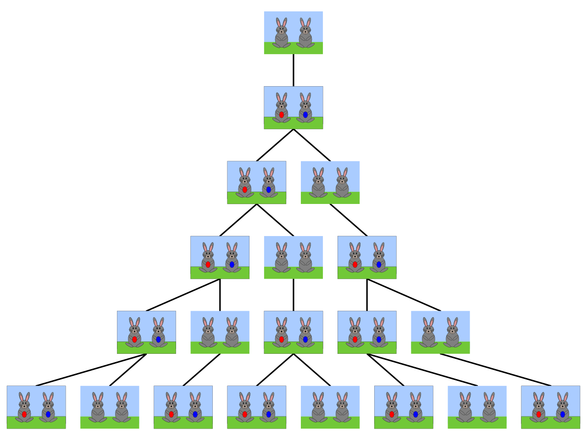

## Comandos de Repetição
### FOR, WHILE, DO-WHILE

---

### Objetivos
Utilizar corretamente _comandos de repetição_. 

Nesta aula estudaremos os comandos:

 - `for`
 - `while`
 - `do-while`
 - `break` e `continue`


#### Problemas a resolver
Situações nas quais precissamos repetir a mesma operação várias vezes, ex. para
calcular um somatório, determinar o menor elemento de uma sequência, etc. 

---

### Comandos de Repetição

 Comandos de _Iteração_ ou _Laços de Repetição_ permitem que um determinado
 comando ou bloco de comandos seja executado  _mais de uma vez_.

 Um comando ou bloco de comandos é executado repetidamente até que *uma
 determinada condição seja alcançada*.

---

### Comando FOR

Vídeo: O comando de repetição for (para) (22m)

---

<iframe width="1206" height="678" src="https://www.youtube.com/embed/dc_4nJilfTs?list=PLLjLO9s7KS4UBrOBelz0GyfiFn4CSqquH" frameborder="0" allow="accelerometer; autoplay; clipboard-write; encrypted-media; gyroscope; picture-in-picture" allowfullscreen></iframe>


---

### Comando While

Vídeo: O comando de repetição while (enquanto) (8:48)

---

<iframe width="1206" height="678" src="https://www.youtube.com/embed/gPmA43hnPhM?list=PLLjLO9s7KS4UBrOBelz0GyfiFn4CSqquH" frameborder="0" allow="accelerometer; autoplay; clipboard-write; encrypted-media; gyroscope; picture-in-picture" allowfullscreen></iframe>

---

### Laços Infinitos

Um laço infinito ou *loop infinito* é um laço de repetição cuja condição  _é sempre verdadeira_. 

O bloco de comandos internos do laço é executado indefinidamente!

```cpp
int numero;
numero = 0;
while (numero != 10 )
  cout << numero;
```

A condição `numero != 10` *nunca muda!*

---
### Dica de Programação

Toda estrutura de repetição possui 3 componentes: 

- *Inicialização*: Estabelece as condições _iniciais_ para que a estrutura de repetição possa funcionar.
- *Teste*:  Testa alguma condição para saber _quando parar_.
- *Atualização*: _Modifica a variável_ que está sendo testada para evitar um loop infinito.

```cpp
numero = 0; // Inicialização
while (numero != 10 ){  // Teste
  Comando; // Atualização
}
```

---
### Dica de Programação

Toda estrutura de repetição possui 3 componentes: 

- *Inicialização*: Estabelece as condições _iniciais_ para que a estrutura de repetição possa funcionar.
- *Teste*:  Testa alguma condição para saber _quando parar_.
- *Atualização*: _Modifica a variável_ que está sendo testada para evitar um loop infinito.

```cpp
for(i=1; i<=n;i++){ // inicialização, teste e atualização
    Comando; 
}
```
---
### Comando Do-While

Vídeo: O comando de repetição do-while (faça-enquanto) (até 3:33)

---

<iframe width="1206" height="678" src="https://www.youtube.com/embed/BPml3SkrQvY?list=PLLjLO9s7KS4UBrOBelz0GyfiFn4CSqquH" frameborder="0" allow="accelerometer; autoplay; clipboard-write; encrypted-media; gyroscope; picture-in-picture" allowfullscreen></iframe>

---

### For vs While

Geralmente, _while_  é mais usado quando _não se sabe_  quantas vezes um trecho do algoritmo será repetido.

_for_ é ideal para situações em que se sabe o número de repetições.

O gerenciamento da variável contadora no laço _for_ encontra-se no próprio comando, o que pode ser uma vantagem

Um laço _for_ pode ser reescrito usando _while_ e vice-versa.

---
### Comandos Break e Continue

Vídeo: Os comandos break e continue (21.49)
---

<iframe width="1206" height="678" src="https://www.youtube.com/embed/K4Wop7eTO1I?list=PLLjLO9s7KS4UBrOBelz0GyfiFn4CSqquH" frameborder="0" allow="accelerometer; autoplay; clipboard-write; encrypted-media; gyroscope; picture-in-picture" allowfullscreen></iframe>

---
### Exemplo: Sequência Fibonacci

Modelo do crescimento de uma população de coelhos 


1, 1, 2, 3, 5, 8, 13, 21, 34 ,....  Imagem da [Wikipedia](https://pt.wikipedia.org/wiki/Sequ%C3%AAncia_de_Fibonacci#:~:text=Na%20matem%C3%A1tica%2C%20a%20Sucess%C3%A3o%20de,%C3%A0%20soma%20dos%20dois%20anteriores.&text=0%2C1%2C%201%2C%202,%2C%202584%2C%20...%20.)
---
### Exemplo: Sequência Fibonacci

2 problemas:

 1. Dado um número n>2, imprimir os n primeiros termos da sequência
 2. Imprimir a sequências dos número Fibanacci menores que 1000

- Em 1., sabemos, a priori, o número de repetições. 
- Em 2., não sabemos quantos termos devem ser gerados. 

---
### Exemplo: Sequência Fibonacci
#### Calcular os n primeiros termos
```cpp
int main()
{
    int v1=1, v2=1;// Valores iniciais
    int novo;
    int n;//num termos
    cin>>n;
    cout<< v1 << endl << v2 << endl ; // 2 primeiros termos
    for(int i=3 ; i<=n;i++){ // Gerar n-2 termos
        novo = v1 + v2;
        v1 = v2;
        v2 = novo;
        cout << novo << endl;
    }
    return 0;
}
```

---
### Exemplo: Sequência Fibonacci
#### Imprimir os termos menores que 1000
```cpp
int main()
{
    int v1 = 1, v2=1; // Valores iniciais
    int novo;
    cout<< v1 << endl ;
    while(v2<= 1000){ // Imprimir enquanto v2 <=1000
        cout << v2 << endl;
        novo = v1 + v2;
        v1 = v2;
        v2 = novo;
    }
    return 0;
}
// Resultado: 1 1 2 3 ...  233 377 610 987
```
---
### Exemplo: Sequência Fibonacci
#### Imprimir os termos menores que 1000 (utilizando break)
```cpp
int main()
{
    int v1 = 1, v2=1; // Valores iniciais
    int novo;
    cout<< v1 << endl << v2 << endl ;
    while(true){ // loop (potencialmente) infinito! 
        novo = v1 + v2;
        v1 = v2;
        v2 = novo;
        if (novo >1000)
            break; // Termina o laço
        cout << novo << endl ;
    }
    return 0;
}
```

---

### Teste! 

<https://multiprova.ufrn.br/>
