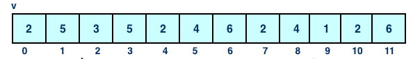

## Vetores

---

### Motivação

> Em geral utilizamos vetores para armazenar vários dados de um mesmo tipo.

Em lugar de escrever
```cpp
int x0, x1, x2,..., x99;
```

Podemos escrever, simplesmente, 
```cpp
int v[100];
```

---
### Motivação

O uso de vetores facilita a solução de alguns problemas, e.x.,:
 - Determinar a letra com maior número de ocorrências em um parágrafo.
 - Ordenar uma sequência de números.
 - Calcular o desvio padrão de um conjunto de dados:

 $\sigma = \sqrt{\frac{1}{N}\sum\limits_{i=1}^{N}(x_i - \mu)^2}$

 - Eliminar os elementos repetido em um conjunto de dados.

---

### Objetivos
Responder a seguinte pergunta:

Aprendi que _uma variável_ guarda _UMA_ informação... 

Mas nem tudo pode ser representado através de UMA informação. 

Existe uma maneira de trabalhar com _diversas informações_? 

Ou para cada informação eu precisarei de uma variável?

---
### Vetores
#### Declaração, inicialização e uso

Vídeo Vetores em C++ (13.26)

---
<iframe width="1124" height="632" src="https://www.youtube.com/embed/VhLJsebEhDc?list=PLLjLO9s7KS4UBrOBelz0GyfiFn4CSqquH" frameborder="0" allow="accelerometer; autoplay; clipboard-write; encrypted-media; gyroscope; picture-in-picture" allowfullscreen></iframe>

---

### Definição
> _Coleção_ de variáveis __do mesmo tipo__ referenciada por um _nome comum_. 

Cada elemento é acessado por meio de um _índice_. 

---

### Declaração

Sempre utilizaremos uma constante para declarar o tamanho do vetor. 

```cpp
#define TAM 100

...

float v[TAM];
```
---
### Acessando os elementos

__Primeiro índice__: `0`

Em `float v[100]` o __último índice__ é `99`


---
### Exemplo: Índices



Se `x=3` e `y=2`, qual é o valor de cada expressão?

- `v[x*2]`
- `v[v[x+4]]`
- `v[x+y]`
- `v[v[v[7]]]`
- `v[v[1] * v[4]]`

---

### Vetores e estruturas de repetição

```cpp
int main(){
 int i, dados[50];
 // Ler dados
 for(i=0;i<50;i++){
  cin >> dados[i];
 }
 // Imprimir o vetor
 for(i=0;i < 50;i++){
  cout << dados[i] << " " ;
 }
 return 0;
}
```

 - A linguagem C++ não realiza _verificação de limites de vetores_.
 - Acessar a uma posição inválida pode _sobrepor dados da memória!_

---

### Inicializar vetores
```cpp
int dmes[12] = {31,28,31,30,31,30,31,31,30,31,30,31};

```

Os elementos de um array podem ser inicializados _unicamente quando o array é declarado_. 

```cpp
float notas[3];
// O comando de atribuição só é capaz de armazenar UMA informação por vez.
notas = {4.5, 7.0, 8.2}; // Não compila!
```

---

### Inicializar vetores
```cpp
int v[10] = {}; // Todos os elementos inicializados em 0.
int v2[10] = {5,2}; // 5 ,2, 0,0 ,..., 0
int v3[] = {1,2,3} ; // Vetor com 3 elementos
```

---
### Exemplo 1
#### Produto Escalar

Video Exercício Resolvido: Produto escalar (5.05)

---
<iframe width="1124" height="632" src="https://www.youtube.com/embed/okiZ9mSy95s?list=PLLjLO9s7KS4UBrOBelz0GyfiFn4CSqquH" frameborder="0" allow="accelerometer; autoplay; clipboard-write; encrypted-media; gyroscope; picture-in-picture" allowfullscreen></iframe>

---

### Exemplo 2
#### Imprimir sem repetir

Vídeo: Exercício resolvido: imprimir os elementos de um vetor sem repetir valores (5.06)

---

<iframe width="1124" height="632" src="https://www.youtube.com/embed/PZHVaMNO8B8?list=PLLjLO9s7KS4UBrOBelz0GyfiFn4CSqquH" frameborder="0" allow="accelerometer; autoplay; clipboard-write; encrypted-media; gyroscope; picture-in-picture" allowfullscreen></iframe>

---
### Exemplo 3
#### Elementos repetidos

Determinar se em um vetor `v` de `n` inteiros existem elementos repetidos. 

Sugestões ?

---
#### Elementos repetidos
Verificar se o _primeiro_ (`v[0]`) elemento está repetido:

```
1  4  6  8  5  6  9
^  ^
|..|
```
---
#### Elementos repetidos
Verificar se o _primeiro_ (`v[0]`) elemento está repetido:

```
1  4  6  8  5  6  9
^     ^
|.....|
```
---
#### Elementos repetidos
Verificar se o _primeiro_ (`v[0]`) elemento está repetido:

```
1  4  6  8  5  6  9
^        ^
|........|
```
---
#### Elementos repetidos
Verificar se o _primeiro_ (`v[0]`) elemento está repetido:

```
1  4  6  8  5  6  9
^                 ^
|.................|
```

__Conclusão:__
- O primeiro elemento não está repetido
- Note que comparamos `v[0]` contra todos os outros elementos (`v[1],...,v[6]`)

---
#### Elementos repetidos
Verificar se o _segundo_ (`v[1]`) elemento está repetido:

```
1  4  6  8  5  6  9
   ^  ^
   |..|
```
---
#### Elementos repetidos
Verificar se o _segundo_ (`v[1]`) elemento está repetido:

```
1  4  6  8  5  6  9
   ^     ^
   |.....|
```
---
#### Elementos repetidos
Verificar se o _segundo_ (`v[1]`) elemento está repetido:

```
1  4  6  8  5  6  9
   ^              ^
   |..............|
```
__Conclusão:__
- O _segundo_ elemento não está repetido
- Note que comparamos `v[1]` contra todos os outros elementos a direita  (`v[2],...,v[6]`)

---

#### Elementos repetidos
Verificar se o _terceiro_ (`v[2]`) elemento está repetido:

```
1  4  6  8  5  6  9
      ^  ^
      |..|
```
---
#### Elementos repetidos
Verificar se o _terceiro_ (`v[2]`) elemento está repetido:

```
1  4  6  8  5  6  9
      ^     ^
      |.....|
```
---
#### Elementos repetidos
Verificar se o _terceiro_ (`v[2]`) elemento está repetido:

```
1  4  6  8  5  6  9
      ^        ^
      |........|
```

- Encontramos 2 elementos iguais!
- Portanto, existem elementos repetidos
- Não precisamos continuar percorrendo o vetor

---
### Elementos repetidos
```cpp
#include < iostream>
#define TAM 100
using namespace std;

int main(){
  int n, v[TAM];
  int i,j;
  bool repetido = false; //Flag
  cin >> n ;
  // Ler os valores do vetor
  for (i=0;i < n ; i++)
      cin >> v[i];

  // Elementos repetidos?
  for (i=0 ; i < n ; i++){
      for(j=i+1 ; j < n ; j++){
          if(v[i] == v[j])
              repetido = true;
      }
  }

  if(repetido)
      cout << "Vetores com elementos repetidos" << endl ;
  else
      cout << "Vetores sem elementos repetidos" << endl ;

  return 0;
}

```
---
### Elementos repetidos
Nosso código não para depois de encontrar o primeiro elemento repetido:
```cpp
  for (i=0 ; i < n ; i++){
      for(j=i+1 ; j < n ; j++){
          if(v[i] == v[j])
              repetido = true;
      }
  }

```

Isso significa continuar comparando mesmo se `repetido=true`

---
### Elementos repetidos
Solução: utilizando `break`
```cpp
  for (i=0 ; i < n ; i++){
      for(j=i+1 ; j < n ; j++){
          if(v[i] == v[j]){
              repetido = true;
              break; // termina o laço interno
          }
      }
      if (repetido) 
          break; // termina o laço externo
  }
```

---
### Teste

<https://multiprova.ufrn.br/>
