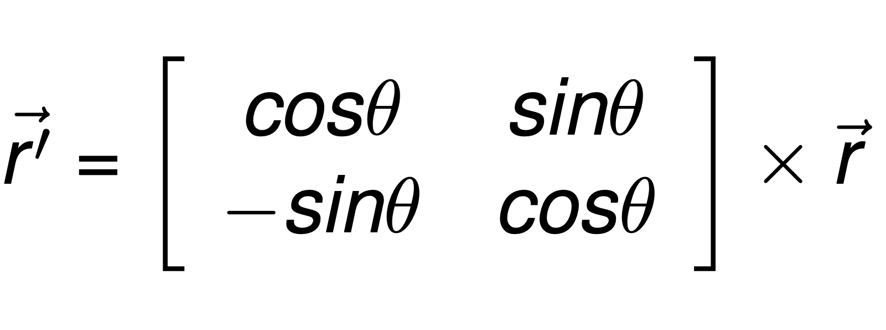

## Funções, vetores e matrizes
---
## Objetivo da aula

- Mostrar passagem de vetores como _parâmetros de funções_.
-  Resolver exercícios.

---

### Revisão

Em geral, pode-se passar parâmetros para funções de duas maneiras:
-  _Por valor_: o _valor_ do argumento _é copiado_ para o parâmetro e as
   alterações feitas no parâmetro _não tem efeito_ sobre a variável usada na
   chamada da função.
- _Por referência_: o _endereço de uma variável_ é copiado para o parâmetro,
  portanto, as mudanças feitas no parâmetro _afetam a variável usada_ na
  chamada da função

---

### Exemplo de parâmetros por referência

```cpp
#include < iostream>
using namespace std;
// x e y são parâmetros por referência.
void trocar (int &x, int &y); // &: referência
int main (){
  int a=5,b=7;
  cout<< "a=" << a << " b=" << b << endl;
  trocar(a,b);
  cout << "a=" << a << " b=" << b << endl;
  return 0;
}
void trocar (int &x, int &y){
  int temp = x;
  x = y;
  y = temp;
}
```
---
### Vetores como argumento de funções
O nome de um  vetor (_sem os colchetes_) representa o _endereço_ onde o vetor  está armazenado.

Ao passar o _nome de um vetor_ para uma função __não se cria uma cópia do vetor__, a passagem é feita por _referência_.

Deve-se fornecer o _tamanho do vetor_ _como parâmetro_ para que a função trabalhe corretamente.

---
### Exemplo: Imprimir um vetor de inteiros

```cpp[1-5|6-14|15-21]
#include < iostream>
using namespace std;
// n é o tamanho do vetor v
// Note que NÃO precisa do operador &
void imprimir(int v[], int n);
int main (){
   int vetor1[] = {5, 10, 15};
   int vetor2[] = {2, 4, 6, 8, 10};
   // O nome do vetor sem colchetes
   imprimir(vetor1, 3);
   // Segundo parâmetro é o tamanho
   imprimir(vetor2, 5);
   return 0;
}

void imprimir(int v[], int n) {
   for (int i=0; i < n; i++)
      cout << v[i] << " ";
   cout << endl ;
}
```
---

### Calcular a média

```cpp[1-4|5-12|14-17|19-24]
#include < iostream>
#define TAM 200
using namespace std;

float calcula_media(float notas[], int tamanho);

int main (){
   int tam; float media, notas[TAM];
   cout << "Qual o tamanho da turma? "; 
   cin >> tam;

   for(int i = 0; i < tam; i++)
      cin >> notas[i];

   media = calcula_media(notas, tam);
   cout << "A media é: " << media << endl;
   return 0;
}

float calcula_media(float notas[], int tamanho){
   float media = 0;
   for(int i = 0; i < tamanho; i++)
      media += notas[i];
   return  media/tamanho;
}
```
---
### Soma de dois vetores
A soma de dois vetores é  um vetor

Porém, não podemos retornar um vetor (sem utilizar memória dinâmica)

Portanto, utilizaremos um terceiro parâmetro para armazenar o resultado. 

---
### Soma de dois vetores
```cpp
void soma(int A[], int B[], int C[], int n){
   for(int i = 0; i < n; i++)
      C[i] = A[i] + B[i];
}

```
O espaço para guardar o resultado é alocado pela função chamadora (por exemplo
a main). Assim, a função soma recebe três vetores: dois com dados de
_entrada_ (A e B) e um _para armazenar o resultado_ (C)

---
### Soma de dois vetores
```cpp
int main(){
 int A[] = {1,2,3};
 int B[]= {4,5,6};
 int C[3];
 soma(A,B,C,3);
 imprimir(C,3);
 return 0;
}
```
---
### Imprimir uma matriz
O número de colunas __sempre__ deve ser fornecido

```cpp
void imprimir(int M[][TAM], int n, int m){
   for(int i=0; i < n; i++){
    for(int j=0; j < m; j++)
        cout << M[i][j] << " ";

    cout << endl ;
   }
}
```
---
### Ler os valores de uma matriz
O número de colunas __sempre__ deve ser fornecido
```cpp
void ler(int M[][TAM], int n, int m){
   for(int i=0; i < n; i++){

    for(int j=0; j < m; j++)
        cin >>  M[i][j];
   }
}
```
---
### Soma de duas matrizes

```cpp
void soma(int A[][TAM], int B[][TAM], int C[][TAM], 
          int n, int m){
   for(int i=0; i < n; i++){

    for(int j=0; j < m; j++){

      C[i][j] = A[i][j]+B[i][j];
    }
  }
}
```
---
### Soma de duas matrizes
Utilizando as três funções anteriores
```cpp
int main(){
    int M1[TAM][TAM], M2[TAM][TAM], M3[TAM][TAM];
    int n,m;
    cin >> n >> m ;// Dimensões da matriz

    ler(M1, n , m);
    ler(M2, n , m);
    soma(M1,M2,M3, n, m);
    imprimir(M3, n, m);
    return 0;
}
```
--- 
### Converter uma string para inteiro

Considere uma string cujos elementos  são todos dígitos, por exemplo, "1234". 
Como podemos converter essa string no número inteiro 1234?

--- 
### Converter String em Inteiro

- `'0'` é o número 48 na tabela ASCII
- `'1'` é o número 49 na tabela ASCII
- Portanto,`'1' - '0' --> 1`

A ideia:
- Percorrer a string.
- Por cada caractere `c` calcular `c - '0'
- Acumular o somatório

---
### Converter String em Inteiro

```cpp[1-6|8-17|18-28]
#include < iostream>
#define TAM 30

using namespace std;

int converterInt(char s[]);

int main(){
    char str[TAM];
    int i;

    cin >> str;
    i = converterInt(str);

    cout << i << endl;
    return 0;
}
int converterInt(char s[]){
    int soma=0;
    int l = strlen(s);
    int d;

    for (int i=0; i < l ; i++){
        d = s[i] - '0';
        soma = soma*10 + d;
    }
    return soma;
}
```
---

## Matriz de permutação

Uma matriz quadrada é chamada matriz de permutação se seus elementos são apenas
0's e 1's e se em cada linha e coluna da matriz existe apenas um único valor 1. Por exemplo, 


---
## Matriz de permutação

1. Uma função para determinar se uma coluna está OK
2. Uma função para determinar se uma linha está OK
3. Uma função que verifica todas as linhas e colunas 

---
## Matriz de permutação
Verificar uma coluna 

```cpp
bool colOK(int M[][MAX], int col, int n){
    int soma = 0;
    for(int i = 0 ; i< n;i++){
        if (M[i][col] != 0 && M[i][col] != 1)
            return false;

        soma+= M[i][col];
    }
    return soma == 1 ;
}
```
---
## Matriz de permutação
Verificar uma linha

Note que o parâmetro __é um vetor e não uma matriz__

```cpp
bool linhaOK(int v[], int n){
    int soma = 0;
    for(int i = 0 ; i < n ; i++){
        if (v[i] != 0 && v[i] != 1)
            return false;

        soma+= v[i];
    }
    return soma == 1;
}
```
---
## Matriz de permutação

A função que verifica todas as linhas e colunas

```cpp
bool permute(int M[][MAX], int n){
    for(int i = 0 ; i < n ; i++){
        // M[i] é um vetor!
        if (!linhaOK(M[i],n))
            return false;
    }

    for(int i = 0; i < n;i++){
        if (!colOK(M,i, n))
            return false;
    }

    return true;
}
```

---
## Matriz de permutação

O bloco main: 

```cpp
int main()
{
    int n,M[MAX][MAX];
    cin >> n;
    ler(M, n, n);

    if(permute(M, n))
        cout << "É matriz de permutação" << endl;
    else
        cout << "Não é matriz de permutação" << endl;
    return 0;
}
```

---
### Teste!
<https://multiprova.ufrn.br/>

---
### Elementos repetidos

Determinar se uma matriz $M$ de dimensão $n \times m$ possui elementos repetidos.

--- 

### Elementos repetidos

- Vamos implementar uma função que, dado um número $x$, retorne o número de vezes que
$x$ ocorre na matriz. 
- Se um valor ocorrer mais de uma vez, então a matriz possui elementos repetidos. 

---
### Elementos repetidos

Função para contar o número de vezes que $v$ ocorre na matriz:

```
int ocorre(int M[][TAM], int v, int n, int m){
    int cont =0;
   for(int i=0; i < n; i++){
    for(int j=0; j < m; j++){
        if (M[i][j]==v)
            cont ++;
    }
   }
   return cont;
}
```
---
### Elementos repetidos

Utilizando a função anterior, podemos determinar se a matriz possui ou não elementos
repetidos:

```
bool repetidos(int M[][TAM], int n, int m){
   for(int i=0; i < n; i++){
    for(int j=0; j < m; j++){
        if (ocorre(M, M[i][j], n ,m) >1)
            return true;
    }
   }
   return false;
}
```

---
### Elementos repetidos

Exemplo de uso:

```cpp
int main(){
    int M[TAM][TAM] = { {1,2,3},{4,2,6},{7,8,9}};
    if(repetidos(M,3,3))
        cout << "sim" << endl;
    else
        cout << "não" << endl;

}
```
---
### Elementos repetidos

Exemplo de uso:

```cpp
int main(){
    int M[TAM][TAM];
    int lin, col;
    cin >> lin >> col;
    ler(M, lin, col);

    if(repetidos(M,lin,col))
        cout << "sim" << endl;
    else
        cout << "não" << endl;
}
```
---
### Linhas Iguais

Escreva uma função que recebe uma matriz $M$, o seu número de linhas e colunas, e
retorna true se $M$ possui duas linhas iguais e false caso contrário.

---
### Linhas Iguais
- Vamos implementar uma função que, dadas duas linhas l1 e l2, determine se elas são iguais
- Depois, utilizaremos essa função para resolver o problema

---
### Linhas Iguais
Aqui temos uma função que compara se __2 vetores__ são iguais

```
bool linhasIguais(int v1[], int v2[], int n){
    for(int i=0 ; i < n ; i++){
        if(v1[i]!=v2[i])
            return false;
    }
    return true;
}
```
---
### Linhas Iguais
- Como podemos utilizar essa função com as _linhas de uma matriz?_
- Lembre que $M[i]$ representa um vetor (a linha $i$ da matriz)

---
### Linhas Iguais
```
bool matrizl(int M[][Max],int nl,int nc){
    for(int i=0 ; i < nl ;i++){
        for(int j=i+1 ; j < nl ; j++){
            if(linhasIguais(M[i], M[j], nc))
                return true;
        }
    }
    return false;
}
```

Note o uso de `M[i]` e `M[j]`

---
### Linhas Iguais
Uma alternativa:

```
bool linhasIguais(int M[][TAM], int l1, int l2,  int n){
    for(int i=0; i < n;i++){
        if(M[l1][i]!=M[l2][i])
            return false;
    }
    return true;
}
```
---
### Linhas Iguais
Uma alternativa:
```
bool matrizl(int M[][Max],int nl,int nc){
    for(int i=0; i < nl;i++){
        for(int j=i+1 ; j < nl;j++){
            if(linhasIguais(M, i, j , nc))
                return true;
        }
    }
    return false;
}
```
---
### Xadrez e torres
- No xadrez a torre se move em linha reta horizontalmente e verticalmente.
-  Considere uma matriz quadrada M de dimensão n x n (n <= 100) que representa um tabuleiro de xadrez no qual podemos colocar torres da _mesma cor_.
- Um número 1 na matriz representa uma posição com uma torre e um 0 representa um espaço livre. 
---
### Xadrez e torres
- Faça uma função que, dado um tabuleiro de dimensão n x n, determine (retornando true/false) se alguma das torres pode atacar outra torre. Por exemplo, no tabuleiro

Retorna: true
```cpp
0 1 0 1 <-- ataque
0 0 0 0
0 0 1 0
0 0 0 0
```
Retorna: false:
```cpp
0 1 0
1 0 0
0 0 1
```
---
### Xadrez e torres
- Vamos contar o número de 1's por cada linha e por cada coluna
- Se esse contador for maior que um, as torres podem atacar-se

---
### Xadrez e torres
Função para verificar uma linha:
```cpp
bool linhaOK(int v[], int n){
    int soma=0;
    for(int i=0; i < n;i++){
        if (v[i]!=0 && v[i]!=1)
            return false;
        soma+= v[i];
    }
    return soma <= 1;
}
```

---
### Xadrez e torres
Função para verificar uma coluna:
```cpp
bool colOK(int M[][MAX], int col, int n){
    int soma=0;
    for(int i=0; i < n;i++){
        if (M[i][col]!=0 && M[i][col]!=1)
            return false;
        soma+= M[i][col];
    }
    return soma <= 1 ;
}
```

---
### Xadrez e torres
Agora só precisamos utilizar as funções anteriores:

```cpp
// Retorna true se alguma torre pode atacarse
// Note que as funções OK retornam true se nenhuma torre pode atacar-se
bool torres(int M[][MAX], int n){
    // Linhas
    for(int i=0; i < n;i++){
        if (!linhaOK(M[i],n))
            return true;
    }
    // Colunas
    for(int i=0;i < n;i++){
        if (!colOK(M,i, n))
            return true;
    }
    return false;
}
```
---
### Multiplicação de matrizes

Faça uma função para multiplicar duas matrizes. 

Lembre: $M \times N$ faz sentido sim:
 - $M$ é de dimensão $a \times b$
 - $N$ é de dimensão $b \times c$
 - O resultado $M\times N$ é de dimensão $a \times c$

---
### Multiplicação de matrizes
O resultado $R = M \times N$:
- A posição $R[i][j]$ corresponde ao produto escalar da linha $i$ de $M$ e a coluna $j$ de $N$.

```
               - x - -
- - - - -      - x - -
x x x x x   *  - x - -
- - - - -      - x - -
               - x - -
```

---
### Multiplicação de matrizes

- Entradas: As matrizes M e N
- As dimensões: a,b,c
- Saídas: A matriz $M \times N$

---
### Multiplicação de matrizes
```cpp
void mult(int M1[][TAM], int M2[][TAM], int nlm1, ncm1, ncm2, int M3[][TAM]){
    for(int i=0 ; i < nlm1 ; i++){
        for(int j=0 ; j < ncm2 ; j++){
            // Produto escalar: 
            // linha i de M1 coluna j de M2
            int soma = 0;
            for (int k = 0 ; k < ncm1 ; k++){
                soma += M1[i][k] * M2[k][j];
            }
            M3[i][j] = soma;
        }
    }

}
```
---
### Multiplicação de matrizes
Note que o último parâmetro da função será utilizado como saída: 

```cpp
int main(){
    int A[TAM][TAM], B[TAM][TAM], C[TAM][TAM];
    int la,ca,cb;
    cin >> la >> ca >> cb ;
    ler(A, la, ca);
    ler(B, ca, cb);
    mult(A,B,la,ca,cb,C);
    imprimir(C, a, c);
    return 0;
}
```

---
### Teste!
<https://multiprova.ufrn.br/>

---
### Quadrado Latino

Dizemos que uma matriz quadrada A de dimenssão $n \times n$ é um __quadrado latino__
de ordem $n$  se em cada linha e em cada coluna aparecem todos os inteiros  1,2,3,
.. n. Por exemplo, a matriz

```cpp
1  2  3  4
2  3  4  1
4  1  2  3 
3  4  1  2
```

é um quadrado latino de ordem 4.

Implemente  uma função que,  dada uma matriz  quadrada $A$ de dimensão $n \times n$
( $n  \leq 100$) determine (retornando true/false)  se $A$ é um quadrado latino de 
ordem $n$. 

---
### Quadrado Latino

Podemos reaproveitar um problema que já tínhamos resolvido:

_Implemente uma função que receba como parâmetro de entrada
um vetor de n dígitos (números entre 0 e 9).
A função deve armazenar em um vetor de saída a contagem
de cada dígito do vetor de entrada._

Por exemplo: 
```
contador: [1,2,2,1,2,4,0,0,0,0]
                     ^ 4 vezes o número 5

vetor: [1,4,5,0,5,3,2,5,1,2,4,5]

```

---
### Quadrado Latino

A ideia: Utilizar um vetor para contar os dígitos:

```cpp
                 *
contador = [ 0 , 0 , 0 , 0 , 0 , ... ]
             ^   ^   ^   ^   ^
             0   1   2   3   4

vetor = [ 1 , 3 , 2 , 1 ,...]
          ^
          i

contador[v[i]]++;
```

---
### Quadrado Latino

A ideia: Utilizar um vetor para contar os dígitos:

```cpp
                         *
contador = [ 0 , 1 , 0 , 0 , 0 , ... ]
             ^   ^   ^   ^   ^
             0   1   2   3   4

vetor = [ 1 , 3 , 2 , 1 ,...]
              ^
              i

contador[v[i]]++;
```

---
### Quadrado Latino

A ideia: Utilizar um vetor para contar os dígitos:

```cpp
                     *
contador = [ 0 , 1 , 0 , 1 , 0 , ... ]
             ^   ^   ^   ^   ^
             0   1   2   3   4

vetor = [ 1 , 3 , 2 , 1 ,...]
                  ^
                  i

contador[v[i]]++;
```
---
### Quadrado Latino

A ideia: Utilizar um vetor para contar os dígitos:

```cpp
                 *
contador = [ 0 , 1 , 1 , 1 , 0 , ... ]
             ^   ^   ^   ^   ^
             0   1   2   3   4

vetor = [ 1 , 3 , 2 , 1 ,...]
                      ^
                      i

contador[v[i]]++;
```
---
### Quadrado Latino

A ideia: Utilizar um vetor para contar os dígitos:

```cpp
                 *
contador = [ 0 , 2 , 1 , 1 , 0 , ... ]
             ^   ^   ^   ^   ^
             0   1   2   3   4

vetor = [ 1 , 3 , 2 , 1 ,...]
                         ^
                         i

contador[v[i]]++;
```

---
### Quadrado Latino

Função para verificar _uma linha_ (parâmetro `linha`) utilizando a ideia anterior:
```cpp
bool verificarLinha(int M[][TAM], int n, int linha){
    int v[TAM]={}; // v = [0,0,0,0...0]
    for(int i=0; i < n ;i++){
        // Os números dever estar no intervalo [1,n]
        if (M[linha][i] <= 0 || M[linha][i] > n)
            return false; 
        v[M[linha][i]-1] ++; 
    }
    // Todos os valores devem ser 1
    for(int i=0; i < n;i++)
        if(v[i]!=1) return false;

    return true;
}
```

---
### Quadrado Latino
A função similar para as colunas
```cpp
bool verificarCol(int M[][TAM], int n, int col){
    int v[TAM]={};
    for(int i=0; i < n;i++){
        if (M[i][col] <= 0 || M[i][col] > n)
            return false;
        v[M[i][col]-1] ++;
    }
    // Todos os valores devem ser 1
    for(int i=0;i < n;i++)
        if(v[i]!=1) return false;

    return true;
}
```
---
### Quadrado Latino

Utilizando as duas funções anteriores, resolvemos o problema:
```cpp
bool QDLT(int M[][TAM],int n){
    // Linha
    for(int i=0;i < n;i++)
        if(!verificarLinha(M, n, i)){
            return false;
        }
    // colunas
    for(int i=0;i < n;i++)
        if(!verificarCol(M, n, i))
            return false;

    return true;

}
```

---
### Quadrado Latino

Exemplo de main
```cpp
int main() {
  int M[TAM][TAM],d;
  cin>>d;
  
  for(int i=0;i < d;i++){
    for(int j=0;j < d;j++){
      cin >> M[i][j];
    }
  }
  if(QDLT(M,d)){
    cout << "A matriz é quadrado latino" << endl;
  }
  else{
    cout << "A matriz não é um quadrado latino" << endl;
  }
  return 0;
}
```

---
### Matriz de Rotação

<iframe width="1138" height="640" src="https://www.youtube.com/embed/VtG0emfNAeU" frameborder="0" allow="accelerometer; autoplay; clipboard-write; encrypted-media; gyroscope; picture-in-picture" allowfullscreen></iframe>

---
### Matriz de Rotação

Dado um ponto $\vec{r} = [x,y]$ (um vetor coluna) no plano cartesiano e um ângulo $\theta$, o vetor



representa a rotação de $\vec{r}$ em $\theta$ graus. 

Escreva uma função que recebe como parâmetros $\theta$ e um ponto $\vec{r}$ e calcula $\vec{r'}$.

---
### Matriz de Rotação

As funções trigonométricas da biblioteca `cmath` trabalham em radianos.

```cpp
// Graus em radianos
double toRad(double A){
    return (M_PI * A) / 180.0 ;
}
```

---
### Matriz de Rotação
Calculamos o produto: 
```cpp
void rotar(double v[], double r[], double ang){
    double x,y;
    ang = toRad(ang);
    x = cos(ang) * v[0] + sin(ang)*v[1];
    y = -1 * sin(ang) * v[0] + cos(ang)*v[1];
    r[0] = x;
    r[1] = y;
}
```
- _Entrada_: o vetor `v[]` e o ângulo `ang`
- _Saída_: o resultado será armazenado no parâmetro `r`

---
### Frase Palíndromo

Já implementamos uma função para determinar se uma palavra é palíndromo (ex. radar é palíndromo).
Como resolvemos o problema para frases palíndromo?

> Fica facil escrever palindromos com nomes proprios, como fazem Mezaf Omocso, Irporp Semon, Mocs Omord, Nila Prevercs e Lica Facif

---
### Frase Palíndromo

1. Vamos escrever uma função para eliminar os espaços e sinais ortográficos. 
2. Também, vamos converter todas as letras para minúscula

---
### Frase Palíndromo
```cpp
void remover(char s[], char r[]){
    int n=strlen(s);
    int pos=0;
    for (int i=0; i < n;i++){
        if(isalpha(s[i])){
            r[pos++] = tolower(s[i]);
        }
    }
    // Caractere de terminação 
    r[pos] = 0;
}
```

---
### Frase Palíndromo
A função que determina se uma palavra é palíndromo
```cpp
bool palindromo(char s[]){
    int n=strlen(s);
    for (int i =0; i<= n/2; i++)
        if(s[i]!= s[n-1-i])
            return false;
    return true;
}
```

---
### Frase Palíndromo
A função para determinar se uma frase é palíndromo
```cpp
bool frasepalindromo(char s[]){
    char aux[TAM];
    remover(s, aux);
    return palindromo(aux);
}
```

---
### Matrizes de char 

Podemos ver uma matriz como um vetor de vetores

Portanto, a matriz
```cpp
char M[TAM][TAM];
```

pode ser vista como um vetor de strings

__Cada linha é uma string!__

---
### Matrizes de char

Por exemplo:

```cpp
linha0: 'a' , 'l', 'o' , 0 ....
linha1: 'm' , 'u', 'n', 'd', 'o', 0, ....
linda2: 'h' , 'i', '!', 0, ...
```
---
### Matrizes de char

A função `strcmp` da biblioteca `cstring`
```cpp
int strcmp(char str1[], char str2[]);
```

retorna: 
 - 0 se `s1` é igual a `s2`.
 - $<0$ se `s1 < s2`
 - $>0$ se `s1 > s2`

 Ordem lexicográfica: 

 ```cpp
cout << strcmp("ola", "ola") << endl; //0
//'o' = 111, 'h' = 104
cout << strcmp("ola", "hola") << endl; //7
//'l'=108, 'n'= 110
cout << strcmp("ola","onda") << endl; //-2
```
---
### Matrizes de char

Como podemos buscar uma palavra em uma lista de palavras?

1. Percorremos cada linga da matriz
2. Utilizamos a função `strcmp`

```cpp
// M[i] é uma string!
bool estaPalavra(char M[][TAM], int n, char s[]){
    for(i=0;i < n ; i++){
        if(strcmp(M[i], s)==0)
            return true;
    }
    return false;
}
```
---
### Matrizes de char

Por exemplo:
```cpp
 char portugues[][MAX_LENGTH] =
    { "tirar","pronto","pegar","cha","cartera","acordar",
    "combinar","bolso","cedo","exquisito"};

 if (estaPalavra(portugues, 10, "cedo" ))
     cout << " a palavra está no dicionário! " << endl;
```

---
### Matrizes de char

Podemos utilizar essa ideia para implementar um tradutor muito simples: 

```cpp
 char portugues[][MAX_LENGTH] =
    { "tirar","pronto","pegar","cha","cartera","acordar",
    "combinar","bolso","cedo","exquisito"};

 char espanol[][MAX_LENGTH] = 
    {"sacar","listo","tomar","te","billetera","despertar",
    "acordar","cartera","pronto","raro"};

```
---
### Matrizes de char

Modificamos a função `estaPalavra` para que também retorne o índice:
```cpp
bool estaPalavra(char M[][TAM], int n, char s[], int &idx){
    for(i=0;i < n ; i++){
        if(strcmp(M[i], s)==0){
            idx = i;
            return true;
        }
    }
    idx = -1; // Palavra não encontrada
    return false;
}
```


---
### Matrizes de char

Agora implementamos uma função que "retorne" a palavra:
```cpp
bool traduzir(char DIC1[][TAM], char DIC2[][TAM], 
      int n, char pal1[], char pal2[]);
```

A função retorna `true` se a operação foi bem sucedida. 


---
### Matrizes de char

Como podemos copiar o conteúdo de uma string?

A função `strcpy` da biblioteca `cstring`:
```cpp
char s1[TAM] = "alo";
char s2[TAM];
// Copiar em s2 o contúdo de s1
strcpy(s2, s1); // s2 armazena "alo"
```

---
### Matrizes de char
```cpp
bool traduzir(char DIC1[][TAM], char DIC2[][TAM], 
   int n, char pal1[], char pal2[]){
 int pos;
 bool esta =estaPalavra(DIC1, n, pal1, pos);
 if (esta){
     strcpy(pal2, DIC2[pos]);
     return true;
 }
 else return false;
}
```
---
### Teste
<https://multiprova.ufrn.br/>

