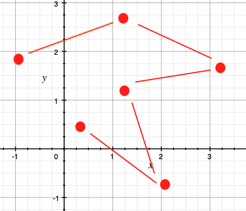

## Tipos Estruturados
---
### Objetivo da aula

Responder à seguinte pergunta:

Eu sei como:
- armazenar _uma_ informação de um tipo (__variável__);
- armazenar _várias_ informações do mesmo tipo _sob um mesmo nome_ (__vetores/matrizes__)

>E se eu quiser armazenar informações de _tipos diferentes_ _sob um mesmo nome_?

---
### Motivação
Muitas vezes precisamos agrupar informações de _tipos diferentes_ sob um __mesmo nome__.

 - _Aluno_: CPF, RG, nome, sobrenome, endereço, etc. 
 - _Disciplina_: Código, nome, créditos, ementa, etc. 
 - _Livro_: ISBN, título, ano, número de páginas, etc. 

---
### Motivação

se eu quiser armazenar os dados dos estudantes da UFRN....

```cpp
char cpf[NUM_EST][TAM_MAX];
char nome[NUM_EST][TAM_MAX];
char email[NUM_EST][TAM_MAX];
int semestre[NUM_EXT];
```

será uma boa solução ?

---
### Tipos Estruturados ou Estruturas de Dados Heterogêneas

Uma estrutura (_struct_) ou registro em C++ é uma coleção de um ou mais valores
(possivelmente de _tipos diferentes_), agrupados sob um _único nome_.

As estruturas são um recurso importante para _organizar_ os dados de um
programa graças à possibilidade de tratar _um grupo de valores como uma única
variável_.

---
### Tipos Estruturados 

Uma estrutura é um _tipo_ de dado cujo formato é _definido_ pelo programador.

Vídeo Tipos estruturados: definição, declaração de variáveis e acesso aos campos (11.02)

---
<iframe width="1122" height="631" src="https://www.youtube.com/embed/kh3Z2ywZJmI" frameborder="0" allow="accelerometer; autoplay; clipboard-write; encrypted-media; gyroscope; picture-in-picture" allowfullscreen></iframe>
---

### Definição de tipos estruturados

Elementos individuais de uma estrutura são chamados _membros_;

Os membros podem ter _tipos diferentes_ (primitivo, matriz ou struct);

O nome de uma estrutura agrega vários membros, enquanto os membros, individualmente, devem possuir _identificadores únicos_

---
### Definição

```cpp
// Cada identificador define um membro.
struct Nome{
 tipo1 identificador1; 
 ...
 tipon identificadorn; 
 } ;
```

---
### Definição
Armazenar uma data
```cpp
struct Data {
  int dia;
  int mes;
  int ano;
} ;
```
---
### Definição

Os membros podem ser vetores ou outros tipos struct:
```cpp
struct contaBancaria{
 char Nome[15];
 char ContaNo[10];
 double saldo;
 Data abertura;
};
```

`Data` é um tipo _definido pelo usuário_ e podemos utilizar ele
para definir outros tipos estruturados. 

---
### Definição

```
struct Estudante{
 char Nome[15];
 int Id;
 char Curso[20];
 char sexo;
};
```
---
### Declaração de variáveis do tipo `struct`
```
Estrutura Identificador;
```

Exemplo:
```
Estudante E1, E2 ;
```


---
### Acesso aos membros

Os membros de um tipo estruturado são acessados com a utilização do _operador
ponto_(.):

```
variavel.membro;
```

Exemplo:

```cpp
Estudante E;
cin >> E.nome ;
cin >> E.Id;
cin >> E.Curso;
cin >> E.sexo;

if (E.sexo == 'M')
 cout << "Sr. " << E.nome;
else
 cout << "Sra. " << E.nome;
```

---
### Estruturas aninhadas
```
struct Ponto{
   double x, y;
};
struct Linha{
   Ponto p1, p2;
};
struct Triangulo{
   Ponto p1, p2, p3;
};
```

---
### Estruturas aninhadas

---
### Estruturas aninhadas

Como representamos essas figuras?
```cpp
Ponto vp = {4,11}; // Inicializando 
Linha vl = { {2,7}, {10,9}} ;
Triangulo vt; // Declarar e depois atribuir
vt.p1.x = 2; vt.p1.y = 0;
vt.p2.x = 6; vt.p2.y = 5;
vt.p3.x = 8; vt.p3.y = 3;
```

---
### Vetor de estruturas
Um vetor de estruturas armazena em cada posição um tipo estruturado (com vários membros):


---
### Vetor de estruturas

```
Estudante Turma[100];
strcpy(Turma[98].Nome, "Chan Tai Man");
Turma[98].Id = 12345;
strcpy(Turma[98].Curso, "COMP");
Turma[98].Sexo = 'M';
// Podemos utilizar o operador de atribuição!
Turma[0] = Turma[98];

```


---
### Vetor como membro de estrutura
```
struct Quadrilatero{
  Ponto vertices[4];
};

int main(){
  Quadrilatero q;
	...
}
```
---
### Vetor como membro de estrutura


```cpp
Quadrilatero q1 = { { {4,1}, {4,3}, {10,3}, {10,1}} };
Quadrilatero q2;
q2.vertices[0].x = 4 ; q2.vertices[0].y = 1;
q2.vertices[1].x = 4 ; q2.vertices[1].y = 3;
q2.vertices[2].x = 10 ; q2.vertices[2].y = 3;
q2.vertices[3].x = 10 ; q2.vertices[3].y = 1;

```

---
### Estruturas como parâmetros de funções

Parâmetros por valor:
```
struct Ponto{
   double x, y;
};

struct Quadrilatero{
  Ponto vertices[4];
};

void print_ponto(Ponto p){
 cout << "(" << p.x << "," << p.y << ")";
}

void print_quadrilatero(Quadrilatero q){
  int i;
  for(i=0;i < 4;i++){
    print_ponto(q.vertices[i]) ;
    cout << endl ;
  }
}
```
---
### Estruturas como parâmetros de funções

Parâmetros por referência 
```
struct Ponto{
   double x, y;
};
struct Quadrilatero{
  Ponto vertices[4];
};

void ler_ponto(Ponto &p){
 cin >> p.x >> p.y;
}
void ler_quadrilatero(Quadrilatero &q){
    for(int i=0; i < 4 ; i++)
        ler_ponto(q[i]);
}
```

---
### Exemplo
Foi realizada uma pesquisa entre 100 habitantes de uma certa região. De cada
habitante foram coletados os dados: CPF, idade, sexo, salário e número de
filhos. Construa um programa C++ que armazene as informações da pesquisa e
calcule a média do salário dos habitantes e de filhos e liste os habitantes com
salário inferior a média e o número de filhos superior a média.

---
### Exemplo

Primeiro definimos a estrutura para armazenar os dados das pessoas:
```
struct Pessoa{
    char cpf[12];
    int idade;
    char sexo;
    float salario;
    int nfilhos;
};
```
---
### Exemplo

Podemos definir pelo menos 4 funções:
```cpp
void ler(Pessoa &P); // ler as informações de uma pessoa
void imprimir(Pessoa P); // imprimir as informações de uma pessoa
float mediaSalarios(Pessoa vp[], int n); // calcular a média dos salários
float mediaFilhos(Pessoa vp[], int n); // calcular a média do número de filhos
```
---
### Exemplo
Implementar as funções
```cpp
void ler(Pessoa &P){
    cin >> P.cpf >> P.idade >> 
    P.sexo >> P.salario >> P.nfilhos;
}
```

---
### Exemplo
Implementar as funções
```cpp
void imprimir(Pessoa P){
    cout<< "CPF: "<< P.cpf << " idade: " << P.idade
        << " sexo: " << P.sexo << " salário: " << P.salario
        << " número de filhos: " << P.nfilhos << endl ;
}
```

---
### Exemplo
Implementar as funções
```cpp
float mediaSalarios(Pessoa vp[], int n){
    float soma =0;
    for(int i=0 ; i < n ; i++){
        soma += vp[i].salario;
    }
    return soma / n ;
}
```

---
### Exemplo
Implementar as funções
```cpp
float mediaFilhos(Pessoa vp[], int n){
    int soma =0;
    for(int i=0 ; i < n ; i++){
        soma += vp[i].nfilhos;
    }
    return (float) soma / n ;
}
```

---
### Exemplo
Agora sim, podemos implementar a função `main`:
```cpp[1-5|7-9|11-15|17-23]
int main(){
    Pessoa dados[TAM];
    int n;
    float msalario, mfilhos;
    cin >> n;

    // Ler os dados das n pessoas
    for(int i=0 ; i < n ; i++)
        ler(dados[i]);

    // calcular as médias
    msalario = mediaSalarios(dados, n);
    mfilhos = mediaFilhos(dados, n);
    cout << "Média Salário: " << msalario
        << " Média Número de Filhos: " << mfilhos << endl;

    // Imprimir as pessoas
    for(int i=0 ; i < n ; i++){
        if(dados[i].salario < msalario &&
           dados[i].nfilhos > mfilhos)
            imprimir(dados[i]);

    }
    return 0;
}
```

---
### Teste

<https://multiprova.ufrn.br/>

---
## Aula 02
---
### Distância entre pontos

Na última aula implementamos uma função para calcular a distância
entre dois pontos:

```cpp
struct Ponto {
	double x, y;
};

double dist (Ponto p1, Ponto p2) {
	return sqrt(pow(p2.x - p1.x, 2) + 
                pow(p2.y - p1.y, 2));
}
```

---
### Distância entre pontos
Como podemos calcular a distância em um "caminho" de pontos?

---
### Distância entre pontos

Representaremos o caminho como um vetor de pontos:

```cpp
Ponto caminho[TAM];
```

E definimos uma função com protótipo:
```cpp
float distancia(Ponto vp[], int n);
```

---
### Distância entre pontos
A função simplesmente calcula o somatório das distâncias:

```cpp
float distancia(Ponto vp[], int n){
    float soma=0;
    for(int i = 0 ; i < n - 1 ; i++){
        soma += dist(vp[i], vp[i+1]);
    }
    return soma;
}
```

---
### Números Complexos
Como representamos um número complexo?
```cpp
struct Complexo{
  double real;
  double img;
};
```
---
### Números Complexos
Agora podemos  utilizar números complexos nos nossos programas:
```cpp
  Complexo c;    //Variável tipo Complexo
  c.real = 3.4;  //Parte real
  c.img = 12.2;  // Parte imaginária
```

---
### Números Complexos

Muito mais interessante, podemos definir diferentes funções utilizando 
números complexos. 

```cpp
void print(Complexo x){
  cout << x.real;
  if (x.img <0)
    cout << " - " ;
  else
    cout << " + " ;

  cout << x.img << "i" << endl;
```
---
### Números Complexos

Módulo de um complexo: $ Z = \sqrt{real^2 + img^2}$

```cpp
double modulo(Complexo x){
  return sqrt(pow(x.real,2.0) +
              pow(x.img,2.0));
}
```

---
### Números Complexos
Quando 2 números complexos são iguais ?

- A parte real deve ser igual
- A parte imaginária deve ser igual

---
### Números Complexos
Quando 2 números complexos são iguais ?

- A parte real deve ser igual
- A parte imaginária deve ser igual
```cpp
bool iguais(Complexo x, Complexo y){
  if(x.real == y.real && x.img == y.img)
    return true;
  else
    return false;
}
```
---
### Números Complexos

Soma de números complexos. 

Qual deveria ser o protótipo da função?

---
### Números Complexos
Soma de números complexos. 

```cpp
Complexo soma(Complexo x, Complexo y){
  Complexo z;
  z.real = x.real + y.real;
  z.img = x.img + y.img;
  return z;
}
```

Note que a função __retorna__ um número complexo. 

---
### Números Complexos

O conjugado de $ Z = a + bi$ é 

$\overline{Z} = a - bi$

---
### Números Complexos
O conjugado de $ Z = a + bi$ é 

$\overline{Z} = a - bi$

```cpp
Complexo conjugado(Complexo x){
  Complexo z;
  z.real = x.real;
  z.img = -1.0 * x.img;
  return z;
```

Novamente, a função __retorna__ o resultado (um número complexo). 

---
### Números Complexos

Um exemplo:

```cpp
int main(void){
  Complexo c, d;
  c.real = 3.1;
  c.img = 5.4;
  d.real = 2.2;
  d.img = 7.0;

  cout << "Iguais: " << iguais(c,d) << endl;
  print(conjugado(c));
  cout << modulo(d) << endl;
  print(conjugado(soma(c,d)));
  return 0;
}
```
---
## Tipos de dados Enumerados

---
### Enumeração
_Enumeração_: Conjunto de constantes _inteiras_ em que cada uma delas é
representada por um nome

```cpp
enum Mes {Jan, Fev, Mar, Abr, Mai, Jun, Jul, Ago, Set, Out, Nov, Dez};

int main(void){
  Mes m1, m2;
  m1 = Dez;
  m2 = Abr;
  cout << "m1=" << m1 << endl; // 11
  cout << "m2=" << m2 << endl; // 3
  return 0;
}
```

---
### Exemplo
```
enum ESexo {Feminino, Masculino};

// Struct e Enum:
struct Pessoa{
  char nome[50];
  ESexo sexo;
};

int main(){
    Pessoa P;
    strcpy(P.nome, "Maria");
    P.sexo = Feminino;
    ...
    return 0;
}
```

---
### Exemplo

Queremos filtrar uma lista de pessoas e selecionar só as mulheres. 

- Entrada: Um vetor de pessoas (e seu número de elementos)
- Saída: Um vetor de pessoas 

---
### Exemplo
Queremos filtrar uma lista de pessoas e selecionar só as mulheres. 
```
// Retorna o número de elementos do vetor de saída 
// Segundo vetor: saída da função
int filtrar(Pessoa vp[], int n, Pessoa vmulheres[]){
    int pos = 0; // índice para atribuir valores em vmulheres

    for( int i=0; i < n ; i++){
        if (vp[i].sexo == Feminino)
            vmulheres[vpos++] = vp[i];
    }
    return pos;

}
```
---
### Exemplo
Queremos filtrar uma lista de pessoas e selecionar só as mulheres. 

```
int main(){
    Pessoa dados[TAM], vm[TAM];
    ...
    int nm = filtrar(dados, n, vm);
    imprimir(vm, nm);
    ...
    return 0;
}
```
---
### Teste

<https://multiprova.ufrn.br/>

---
### Aula 03

---
### Exemplo Restaurante
Crie uma estrutura para descrever restaurantes com as  informações a seguir:

 - Nome
 - Endereço
 - Preço Medio
 - Qualidade (pode ser Excelente, Bom ou Regular)
 - Tipo de Comida (pode escolher entre internacional, regional, carnes, vegetariano)

---
### Exemplo Restaurante

Definimos duas enumerações e uma estrutura: 

```
enum EQualidade {Excelente, Bom , Regular};
enum ETipo {Internacional, Regional, Carnes, Vegetariano};

struct Restaurante {
	char nome[50];
    char endereco[100];
    double preco;
    EQualidade qualidade;
    ETipo tipo;
};
```
---
### Exemplo Restaurante
Queremos determinar o restaurante mais barato. 

Definimos várias funções auxiliares:

```
void ler(Restaurante &R){
    int tipo, qualidade;
    cout << "Nome: " ;
    cin.getline(R.nome, 50);
    cout << "Endereço: " ;
    cin.getline(R.endereco, 100);
    cout << "Preço médio: " ;
    cin >> R.preco;
    cout << "Qualidade: (0) para Excelente, (1) para bom e (2) para regular";
    cin >> qualidade ;
    R.qualidade = (EQualidade) qualidade;
    cout << "Tipo: (0) para Internacional, (1) para Regional e (2) para Carnes e (3) para Vegetariano";
    cin >> tipo ;
    R.tipo = (ETipo) tipo;
    cin.get();
}
```

---
### Exemplo Restaurante
Queremos determinar o restaurante mais barato. 

Definimos várias funções auxiliares:
```
void imprimir(Restaurante R){
    cout <<" Nome: " << R.nome << endl;
    switch(R.tipo){
        case Internacional: cout << "Internacional" << endl; break;
        case Regional: cout << "Regional" << endl; break;
        case Carnes: cout << "Carnes" << endl; break;
        case Vegetariano: cout << "Vegetariano" << endl; break;
    }
    cout << " Preço médio:  " << R.preco << endl ;
}
```

---
### Exemplo Restaurante
Queremos determinar o restaurante mais barato. 

```
Restaurante maisBarato(Restaurante vr[], int n){
    double pbaixo = vr[0].preco;
    int menor = 0;

    for(int  i=1 ; i < n ; i++){
        if (pbaixo > vr[i].preco){
            pbaixo = vr[i].preco;
            menor = i;
        }
    }
    return vr[menor];
}
```
Note que a função _retorna um restaurante_

---
### Exemplo Restaurante
Queremos determinar o restaurante mais barato. 
```
int main () {
    int n;
    Restaurante vr[TAM];
    cout << "Número de restaurantes: " ;
    cin >> n;
    cin.get();

    for (int i = 0 ; i < n ; i++){
        ler(vr[i]);
    }

    Restaurante R = maisBarato(vr, n);
    cout << " O Restaurante mais barato é: " ;
    imprimir(R);

	return 0;
}
```

---
### Exemplo Restaurante
Como filtramos uma lista de restaurantes para selecionar só aqueles
avaliados como Excelente?

```
int RExcelente(Restaurante vr[], int n, Restaurante resultado[]){
    int pos = 0 ;

    for(int  i=0 ; i < n ; i++){
        if (vr[i].qualidade == Excelente)
            resultado[pos++] = vr[i];
    }
    return pos;
}
```
 -  A função _retorna_ o número de restaurantes Excelente
 - O parâmetro `resultado` é utilizado para armazenar o __resultado__

---
### Exemplo Restaurante
Como filtramos uma lista de restaurantes para selecionar só aqueles
avaliados como Excelente?

```cpp
int main () {
    int n;
    Restaurante vr[TAM], vrex[TAM];
    cout << "Número de restaurantes: " ;
    cin >> n;
    cin.get();

    for (int i = 0 ; i < n ; i++){
        ler(vr[i]);
    }

    int nexc = RExcelente(vr,n, vrex);
    cout << "Lista dos restaurantes avaliados como Excelente: " << endl ;
    for (int i = 0 ; i < nexc ; i++){
        imprimir(vrex[i]);
        cout << "****" << endl ;
    }
	return 0;
}
```

---
### Listas

Em qualquer sistema precisamos armazenar  vários dados do mesmo tipo. Por exemplo:
- Em uma turma temos 30 estudantes (ordenados alfabeticamente).
- Em um supermercado devemos armazenar a lista de todos os produtos disponíveis.
- Em uma empresa trabalham muitos funcionários.

> Quando utilizamos arrays, o número de elementos a serem armazenados é fixo.

---
### Listas
Considere um sistema    para armazenar os produtos de um supermercado. Neste
caso, precisamos de uma __Lista__ que é  uma  estrutura de dados que oferece
as seguintes operações:

- Adicionar e remover elementos (produtos neste caso)
- Retornar o número de produtos na lista.
- Retornar o elemento em uma posição dada.

---
### Listas

Temos várias opções para implementar a Lista:
- Implementar a lista utilizando _arranjos_.
- Implementar a lista utilizando _listas encadeadas_.

Algumas restrições:
 - A lista não permite remover elementos.
 - Os elementos são inseridos sempre no final da lista.
 - Vamos assumir que a lista tem uma capacidade máxima (fixa).

---
### Listas (Utilizando arranjos)

1. Definimos a estrutura _Produto_ 
2. Definimos a estrutura Lista (de produtos):
3. Implementamos algumas funções para manipular essas estruturas
---
### Listas 

Começamos com produto:
```cpp
struct Produto{
  int id;
  char nome[20];
};
```
---
### Listas 

Função para _criar_ um produto

```cpp
Produto novo(int id, char nome[]){
  Produto P;
  P.id = id;
  strcpy(P.nome, nome);
  return P;
}
```

---
### Listas 

Função para imprimir um produto
```cpp
void imprimir(Produto P){
  cout << P.id << " " << P.nome;
}
```

---
### Listas 
Definimos a lista:

```
struct Lista{
  // TAM= capacidade máxima
  Produto vp[TAM];
  // n=número de elementos atualmente armazenados
  int n;
};
```
---
### Listas 
Agora podemos definir várias funções para manipular a lista:

- Criar uma lista vazia
- Imprimir uma lista
- Testar se a lista está vazia
- Retornar o tamanho da lista
- Inserir um elemento no final da lista
- Retornar um elemento da lista

---

```cpp
// Cirar uma lista vazia
Lista novaLista(){ 
 Lista L;
 L.n = 0;
 return L;
}
```
--- 

```cpp
// Determinar o tamanho da lista
int tamanho(Lista L){ 
 return L.n;
}
```
--- 
 Imprimir
---

```cpp
// Imprimir os elementos da lista
void imprimir(Lista L){
 for(int i=0 ; i < L.n ; i++){
   imprimir(L.vp[i]);
   cout << endl ;
 }
}
```
--- 
Inserir
---

```
// Inserir um elemento no final da lista
bool inserir(Lista &L, Produto P){
  if (L.n == TAM)
    return false;
  L.vp[L.n] = P;
  L.n++;
  return true;
}
```
--- 
Retornar um elemento
---

```
Produto elemento(Lista L, int i){
  if (i<0 || i>= L.n) // Posição não válida
    return L.vp[0];
  return L.vp[i];
}
```
--- 
Um exemplo 
---
```
int main(){
  Lista L = novaLista() ;
  inserir(L, novoProduto(1, "produto1"));
  inserir(L, novoProduto(2, "produto2"));
  inserir(L, novoProduto(3, "produto3"));
  inserir(L, novoProduto(4, "produto4"));
  inserir(L, novoProduto(5, "produto5"));
  imprimir(L);
  ...
 }
```
---
### Listas
Note que a lista já armazena seu próprio tamanho: 
```cpp
void imprimir(Lista L){
  for(int i=0;i < L.n ; i++){
  ...
```
---
### Teste

<https://multiprova.ufrn.br/>
